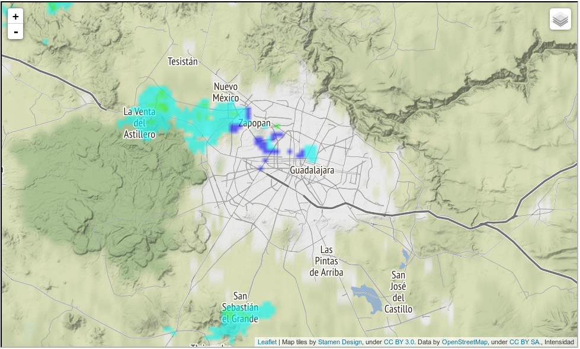
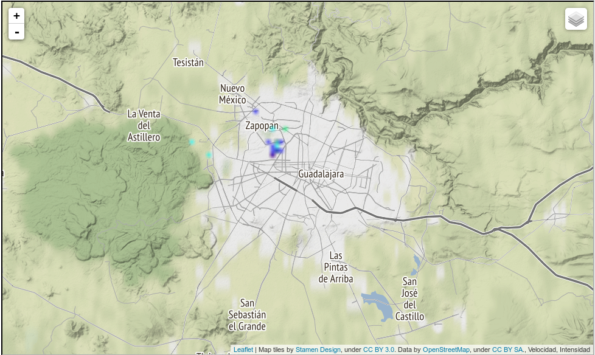

# Jupyter Notebook con el Radar Meteorológico Universidad de Guadalajara

Breve experimento para mostrar las imágenes del Radar Meteorológico de la Universidad de Guadalajara usando [folium](https://github.com/python-visualization/folium) en una [Jupyter Notebook](http://jupyter.org/).

Muestra (lluvia)

Muestra (sin lluvia)

David Ochoa
