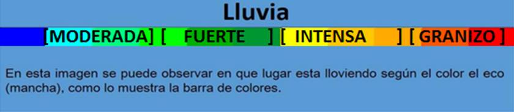
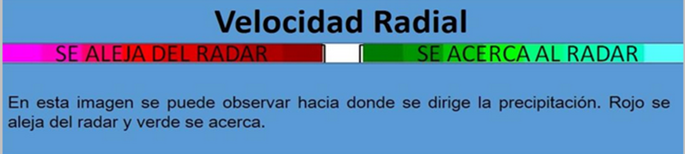

# Jupyter Notebook con el Radar Meteorológico Universidad de Guadalajara

Breve experimento para mostrar las imágenes del [Radar Meteorológico de la Universidad de Guadalajara](http://astro.iam.udg.mx/radar/) usando [folium](https://github.com/python-visualization/folium) en una [Jupyter Notebook](http://jupyter.org/).

Muestra (lluvia)

Muestra (sin lluvia)

Significado de los colores para cada capa (tomado de la página oficial):
* Intensidad:

* Velocidad:

David Ochoa
